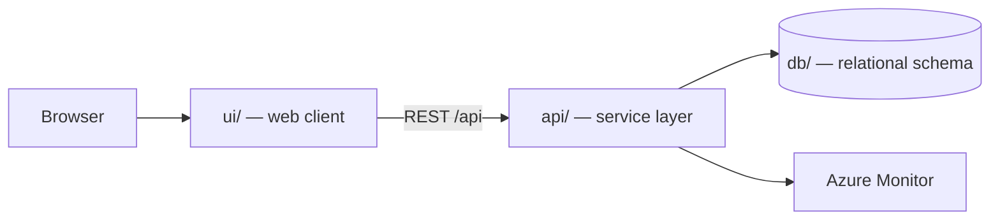

# Fleet Inspection And Maintenance

Generated by the Agentic SDLC workflow.

> Generated by the **Agentic SDLC / Software Factory**. Every change reaches this
> repository through an approved human gate — no agent merges its own work.

## Table of contents

1. [Overview](#overview)
2. [Architecture](#architecture)
3. [API surface](#api-surface)
4. [Screens](#screens)
5. [Folder structure](#folder-structure)
6. [Getting started](#getting-started)
7. [Build and test](#build-and-test)
8. [Deployment](#deployment)
9. [Published links](#published-links)
10. [Requirements scope](#requirements-scope)
11. [Intake documents](#intake-documents)
12. [Licence](#licence)

## Overview

| Item | Value |
| --- | --- |
| Project | Fleet Inspection And Maintenance |
| Business owner | myaacoub@microsoft.com |
| IT owner | myaacoub@microsoft.com |
| Target environment | Dev |
| Work items | Fleet Inspection And Maintenance |
| Repository | https://github.com/csdmichael/fleet-inspection-and-maintenance |

## Architecture

Three tiers, deployed independently from this single repository:



- **ui/** renders the experience and never talks to the database directly.
- **api/** owns validation, authorization, and all data access.
- **db/** holds the schema and forward-only migrations; no ad-hoc changes.

## API surface

The service publishes an OpenAPI document, so the contract is browsable rather than
described in prose. Swagger UI is at `/docs`; the raw document is at `/openapi.json`.
The published URLs appear under [Published links](#published-links) once the pipeline runs.

| Method | Path | Purpose |
| --- | --- | --- |
| `GET` | `/health` | Liveness probe used by the deploy pipeline |
| `GET` | `/api/maintenances` | List maintenances, optionally filtered by `?status=` |
| `POST` | `/api/maintenances` | Create a maintenance |
| `GET` | `/api/maintenances/{id}` | Fetch one maintenance |
| `PATCH` | `/api/maintenances/{id}` | Update title, reference, status, priority |
| `DELETE` | `/api/maintenances/{id}` | Remove a maintenance |

`db/migrations/0002_seed.sql` loads placeholder rows, and the service seeds the same rows,
so a fresh environment returns data on the first request. Replace them with real data.

## Screens

Taken from the approved UX mockups:

- **1**
- **2**
- **3**
- **4**
- **Guided Vehicle Inspection**
- **Interaction Details**

## Folder structure

```
.
├── ui/                  Web client
│   ├── src/             Application source
│   └── package.json     Scripts and dependencies
├── api/                 Service layer (Python (FastAPI))
│   ├── app/             Routers, models, services
│   ├── tests/           Unit and integration tests
│   └── requirements.txt Runtime dependencies
├── db/                  Database
│   ├── migrations/      Forward-only, numbered migrations
│   └── schema.sql       Current consolidated schema
├── docs/                Project documentation
│   ├── architecture.md  Tiers, data flow, decisions
│   ├── api-contracts.md Endpoint contracts
│   ├── data-model.md    Tables and relationships
│   └── delivery-plan.md Sprints and milestones
├── .github/workflows/   CI and Azure deployment pipelines
├── LICENSE              MIT
└── README.md            This file
```

## Getting started

```bash
# API
cd api && python -m venv .venv && .venv/bin/pip install -r requirements.txt
.venv/bin/uvicorn app.main:app --reload --port 8000

# UI
cd ui && npm install && npm start        # http://localhost:4200

# Database
psql "$DATABASE_URL" -f db/schema.sql
```

## Build and test

| Command | Purpose |
| --- | --- |
| `cd api && python -m pytest -q` | API unit tests |
| `cd ui && npm test` | UI unit tests |
| `.github/workflows/ci.yml` | Runs both on every push and pull request |

## Deployment

`.github/workflows/deploy-azure.yml` publishes the API and UI to Azure App
Service using **OIDC federated credentials** — no stored passwords. Configure
these repository secrets and variables first:

| Name | Kind | Purpose |
| --- | --- | --- |
| `AZURE_CLIENT_ID` / `AZURE_TENANT_ID` / `AZURE_SUBSCRIPTION_ID` | secret | OIDC federated login |
| `API_WEBAPP_NAME` / `UI_WEBAPP_NAME` | variable | Target App Service names |

## Published links

<!-- agentic-sdlc:published-links:start -->
| Component | URL |
| --- | --- |
| UI | <https://fleet-inspection-and-maintenance-ui.azurewebsites.net> |
| API | <https://fleet-inspection-and-maintenance-api.azurewebsites.net> |
| Swagger UI | <https://fleet-inspection-and-maintenance-api.azurewebsites.net/docs> |
| OpenAPI document | <https://fleet-inspection-and-maintenance-api.azurewebsites.net/openapi.json> |
| Maintenance API | <https://fleet-inspection-and-maintenance-api.azurewebsites.net/api/maintenances> |
| API health probe | <https://fleet-inspection-and-maintenance-api.azurewebsites.net/health> |

_Published and verified 2026-08-27 05:38 UTC by the Agentic SDLC DevOps & Release Agent via `deploy-azure.yml`. Smoke tests covered the health probe, Swagger/OpenAPI, the UI, and a create/update/delete round trip._
<!-- agentic-sdlc:published-links:end -->

## Requirements scope

- A vehicle-specific, step-by-step inspection experience that enforces evidence capture on failed items and works offline.
- FastAPI endpoints and persistence necessary to store immutable inspection records, defects, and evidence metadata.
- Grounding logic that classifies critical defects, calls the grounding adapter, and drives notification fan-out with retry/fallback rules.
- Front-end UX elements (Angular/Ionic) for the guided checklist, defect capture, and grounding banner/notification status.
- **Environment variables / secrets:** define placeholders for APIM subscription (managed identity), grounding adapter endpoint, Teams webhook / Graph scopes, and Blob SAS configuration for photo uploads (photos remain in immutable storage; API stores reference URIs only).
- **Blob storage upload policy:** front-end to request upload URL via backend `POST /evidence/upload-url`, ensuring evidence immutable after inspection submission.
- **CI jobs:** extend GitHub Actions workflows to run backend pytest suite and Angular unit tests on pull requests affecting respective paths; include SQL migration lint (e.g., `alembic upgrade head --sql` dry run).
- **Checklist loading** – ensures vehicle-type filtering, regulatory category enforcement, and odometer-first rule (US‑101).
- **Inspection submission** – verifies:
- All items require pass/fail outcomes.
- Failed items require photo + ≥15-character description.
- Immutable records (attempted updates rejected).

## Intake documents

- `requirements` — [Fleet Inspection And Maintenance - Requirements.docx](https://github.com/csdmichael/fleet-inspection-and-maintenance/blob/main/docs/intake/requirements/Fleet-Inspection-And-Maintenance-Requirements.docx)
- `technical-requirements` — [Fleet Inspection And Maintenance - Technical Requirements.docx](https://github.com/csdmichael/fleet-inspection-and-maintenance/blob/main/docs/intake/technical-requirements/Fleet-Inspection-And-Maintenance-Technical-Requirements.docx)
- `ux-mockup` — [Fleet Inspection And Maintenance - UX Mockups.docx](https://github.com/csdmichael/fleet-inspection-and-maintenance/blob/main/docs/intake/ux-mockups/Fleet-Inspection-And-Maintenance-UX-Mockups.docx)

## Licence

MIT — see [LICENSE](LICENSE).
